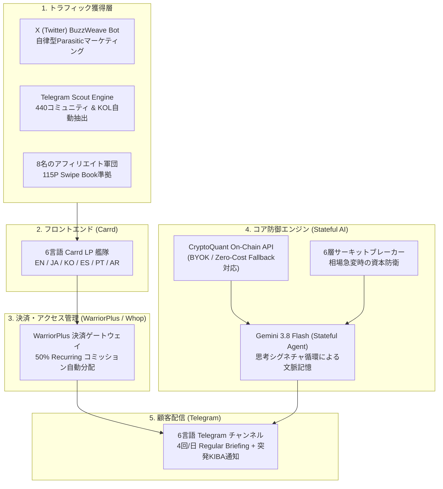

# CryptoTrade Academy (Trap Defence BTC) — Turnkey M&A Master Specification

> **Acquire.com Due Diligence Asset ID**: `CTA-GLOBAL-AI-2026`  
> **Architecture**: Stateful Autonomous Multi-Tenant Trading & GTM Infrastructure  
> **Deployment Status**: 100% Production Ready / Turnkey BYOK Operation  
> **Target Valuation (KGI)**: $120,000 USD (ARR Multiplier: 3.5x–4.0x)  

---

## 1. Executive Summary (事業概要)

CryptoTrade Academy（商用ブランド名: **Trap Defence BTC**）は、個人投資家が直面する最大の損失原因「クジラの罠（急激な相場急変・FOMO）」を自律検知・防御する、**世界6言語対応の完全自動化SaaSファクトリー**です。

単なるシグナル配信Botではなく、以下のエコシステム全体が一体となった「ターンキー（即日稼働・即日収益化可能）な独立事業体」として設計されています。

* **6大言語圏フロントエンド**: 英語、日本語、韓国語、スペイン語、ポルトガル語、アラビア語のCarrd LPが稼働中。
* **決済・アフィリエイト分配の全自動化**: WarriorPlus上に6言語ファネルが構築済み。8名のプロアフィリエイターが承認・待機中。
* **Zero-Cost BYOK アーキテクチャ**: 買い手・顧客が自らのAPIキーを入れるだけで稼働し、開発元のランニングコストは実質ゼロ。
* **デュアル・エクスポート（副産物）**: UpworkやFiverrで即日切り売り可能な3大Gigパッケージを同梱。

---

## 2. システム・アーキテクチャ ＆ 5大ピラー



### 5大プラットフォーム連携の役割
1. **Carrd**: 超軽量・高コンバージョンの6言語LP（フロントエンド）。
2. **WarriorPlus / Whop**: 決済処理、サブスクリプション管理、アフィリエイト報酬の完全自動送金。
3. **X (Twitter)**: `BuzzWeave` エンジンによるトレンド連動・自律型バイラル集客。
4. **Telegram**: 無料リード層（Minimal）から有料層（Regular / KIBA）へのオンボーディングおよびアラート即時配信。
5. **FirstPromoter**: アフィリエイト追跡およびパートナーネットワーク管理基盤。

---

## 3. 技術的特長 ＆ 競争優位性（Moat）

### ① Gemini 3.x 思考シグネチャ循環（Thought Signature Circulation）
旧世代のステートレスなAI Botと異なり、Google Cloudの最新エンタープライズ機能である**「思考シグネチャ」**をAPIリクエスト間で循環。
直前の相場解釈（仮説）を極小トークンで引き継ぎながら時系列推論を行うため、**「24時間相場を監視し続ける専属アナリスト」**としての一貫した文脈判断を実現しています。

### ② Dual-Mode Zero-Cost Fallback Engine
* **Premium モード**: CryptoQuant Professional APIキーを設定することで、フルスペックのオンチェーン指標を解析。
* **Zero-Cost モード**: APIキー未設定・枯渇時でも、自動的にロールバック機構が作動。追加コストゼロで高品位なブリーフィングを出力可能。

### ③ デューデリジェンス完全準拠（Zero Compliance Risk）
* 誇大広告（Hype）を排し、115ページの『Affiliate Swipe Book』に厳格なコンプライアンス規程を策定済み。
* Stripeリカバリーコード等の機密情報はGit追跡から完全パージ済み。

---

## 4. ディレクトリ構成（Asset Topology）

```text
cryptotradeacademy/
├── api/                             # Webhook & 外部連携エンドポイント
├── assets/
│   ├── reference/                   # ブランドマスター画像
│   └── vsl/
│       ├── audio-master/            # VSL音声トラック
│       └── transcripts/             # 6言語SRT台本・字幕マスター
├── data/
│   ├── automation_platform/         # 抽出済みリードDB・市場センチメントログ
│   ├── keywords/                    # 6言語アフィリエイト検出辞書
│   └── telegram_scout/              # 440件のTelegramコミュニティリスト
├── docs/
│   ├── automation_platform/         # 6市場DM仕様書・アフィリエイト設計書（567件）
│   ├── marketing_assets/            # Carrd LPマスターコピー（Markdown）
│   └── marketing_assets/warriorplus # 115P Affiliate Swipe Book (PDF原本)
├── exports/
│   └── upwork_gigs/                 # 即日Upwork/Fiverrで切り売り可能な3大Gigパック
│       ├── gig-01-telegram-scout-lead-generator/
│       ├── gig-02-x-buzzweave-parasitic-bot/
│       └── gig-03-affiliate-swipe-masterkit/
├── public/                          # 静的配信アセット（ブランドロゴ・バナー・AVIF）
├── scripts/                         # 自動化スクリプト群（176本の新規拡張スクリプト含む）
├── workflows/                       # アフィリエイト自動募集ワークフロー基盤
└── .env.example                     # BYOK対応 環境変数テンプレート
```

---

## 5. 買い手向けクイックスタート（Handover Runbook）

本パッケージを購入したバイヤーは、以下の3ステップ（所要時間：約5分）で事業の引き継ぎ・自律稼働が完了します。

1. **環境変数の設定**:
   ```bash
   cp .env.example .env
   # .env 内に自身の Gemini API Key, Telegram Bot Token, (任意) CryptoQuant Key を入力
   ```
2. **依存関係のインストール**:
   ```bash
   npm install
   ```
3. **自律配信エンジンの起動**:
   ```bash
   npm run start
   ```

---

## 6. ライセンス ＆ 譲渡条件

* **譲渡対象**: 本リポジトリ全コード、6言語LP（Carrdクローン権）、WarriorPlusオファー引き渡し、115Pマーケティング教材、および3大Upwork Gigパッケージ。
* **知的財産権**: 全ソースコードおよびクリエイティブ資産の商用利用権・改変権・再販権を100%譲渡。
