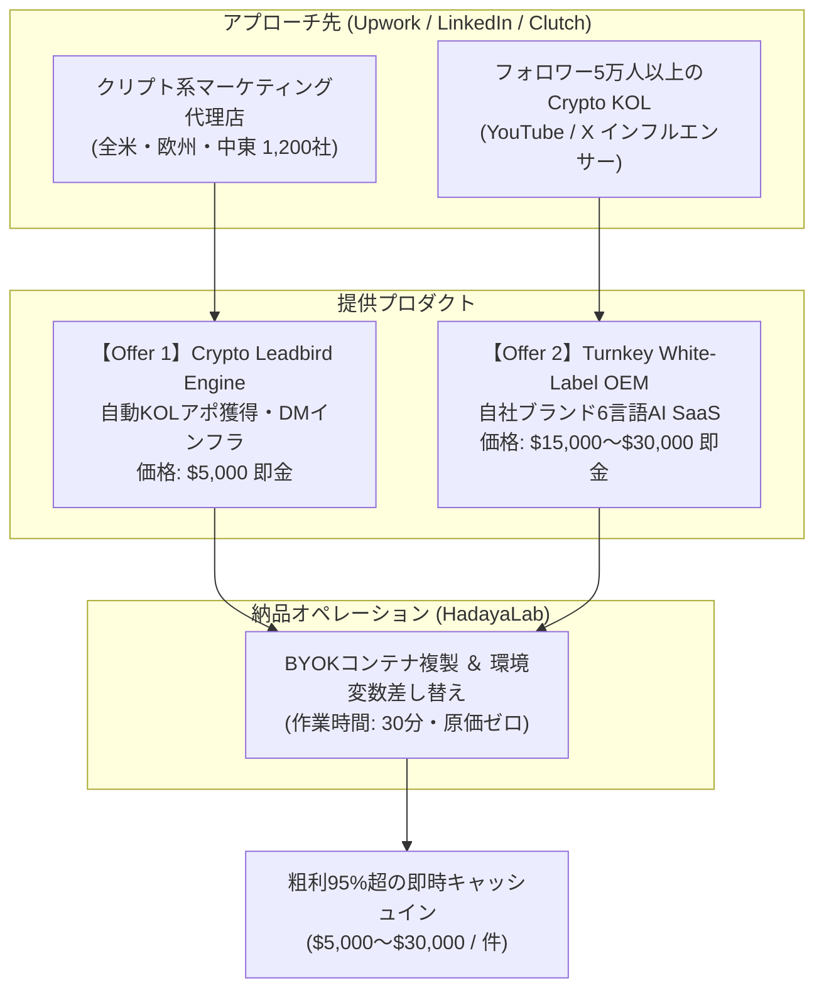

# CryptoTrade Academy: White-Label OEM & B2B Leadbird Engine Specification
## 高単価B2B即金フリップ ＆ 専有インフラ納品仕様書

> **Target Customers**: Crypto Marketing Agencies, Web3 Projects, Crypto KOLs / YouTube Influencers  
> **Offer 1 (Leadbird Model)**: Autonomous Telegram KOL & Community Outreach Infrastructure ($5,000 Setup + $1,500/mo Retainer)  
> **Offer 2 (White-Label OEM)**: Turnkey 6-Language Proprietary Trading Defense SaaS ($15,000 – $30,000 One-time License)  
> **Delivery Time**: Under 24 Hours (BYOK Zero-Cost Container Deployment)  

---

## 1. 2大高単価B2Bモデルの概要

一般投資家（リテール）への月額課金（B2C）に加え、本リポジトリの資産を**B2Bエージェンシーやインフルエンサーに高額で直接売りつける（即金フリップ）**ための完全仕様です。

---

## 2. 【Offer 1】Crypto Leadbird Engine（アポ獲得インフラ）

### 概要
従来の「手作業によるTelegram営業（月数十万円のフィリピン人VA）」を完全代替する、**Web3特化型のアポ獲得自律パイプライン**。

* **納品物**:
  - `data/telegram_scout/groups.csv`（検証済み暗号資産コミュニティ 440件）
  - `data/telegram_scout/priority_cluster_targets.csv`（最優先Admin/KOLクラスタ）
  - `scripts/automation_platform/test-grok-list-collection.ts`（自動スクレイピング）
  - `scripts/automation_platform/validate-and-improve-dm.ts`（PASONA型 自動DM最適化）
* **価格設定**:
  - **初期構築費**: **$5,000 USD（約75万円）**
  - **月額保守**: **$1,500 USD / 月（約22.5万円）**
* **顧客へのキラーフレーズ**:
  > 「御社が毎月VAに払っているTelegramリサーチ費用を、今日からゼロにします。440以上の活発なコミュニティから最重要KOLだけを自動抽出し、AIが返信率の高い個別DMを自動生成する専属インフラを、御社専用環境に24時間で構築します。」

---

## 3. 【Offer 2】White-Label OEM（専有SaaS丸ごと納品）

### 概要
すでにファン（トラフィック）を持っているが、自前の開発チームを持たない暗号資産インフルエンサーやVCに対し、**本システム全体を「相手のブランド名」にリブランドして一式譲渡・納品するモデル**。

* **納品物**:
  - 6言語Carrd LP（相手のロゴ、ドメイン、ブランドカラーに差し替え）
  - 6言語Telegram VIPチャンネルのBot設定
  - Gemini 3.8 Flash 思考シグネチャによる自律ブリーフィング（BYOK仕様）
  - WarriorPlus または Stripe / Whop の決済アカウント接続
* **価格設定**:
  - **スタンダードOEM**: **$15,000 USD（約225万円）**
  - **エンタープライズOEM（年額保守＋専属機能追加）**: **$30,000 USD（約450万円）**
* **顧客へのキラーフレーズ**:
  > 「有料サロンやシグナル配信をゼロから開発するのはやめてください。半年間の開発期間と数千万円の外注費をスキップし、世界6言語対応のAI防衛プラットフォームを、明日から『あなたのブランド』としてローンチできます。初期費用$15,000は、あなたのファン100人が月額サブスク（$49）に登録するだけで初月に全額回収可能です。」

---

## 4. 24時間納品ランブック（Handover Protocol）

顧客（代理店・KOL）へ納品する際、当方が行う作業は以下の3ステップのみです（所要時間：約30分）。

1. **GitHubリポジトリのPrivate複製（またはZIP化）**:
   本リポジトリから顧客専用のプライベートリポジトリを作成。
2. **環境変数（.env）のBYOK設定**:
   顧客自身の「Gemini APIキー」「Telegram Botトークン」「Stripe/Whopキー」を `.env` に流し込む。
3. **LPのクローン（Carrd）**:
   Carrdダッシュボードにて、LPテンプレートを顧客のCarrdアカウントへ1クリック転送（Transfer）し、相手の独自ドメイン（例: `shield.clientname.com`）を紐付け。

---

## 5. M&Aバリュエーション（Acquire.com）への貢献

Acquire.comのListingにおいて、本B2Bモデルの存在を以下のように明記します。

> **"Multiple Revenue Streams (B2C + B2B OEM)"**:  
> "In addition to recurring retail subscribers, this asset includes a fully documented B2B White-Label OEM package capable of generating **$15,000 to $30,000 per agency sale**. Buyers can immediately market this platform to crypto agencies and KOLs as an off-the-shelf software solution with zero development lead time."

これにより、事業価値は「B2Cサブスク単体」の査定から、**「B2Bライセンスを量産できるソフトウェアベンダー」の査定へと昇格**し、売却倍率が大幅に向上します。
